# 几年前在校期间写的一个编码竞赛程序

```
1、ssh2架构  
2、管理员发布编程竞赛题目和答案  
3、学生登录系统，在线提交代码  
4、后台对学生提交的代码实时编译并对运行结果进行评分  
5、输出学生竞赛结果
```

升级

struts2 2.3.37

spring 4.3.18.RELEASE

hibernate 4.3.7.Final

## 截图

### 首页

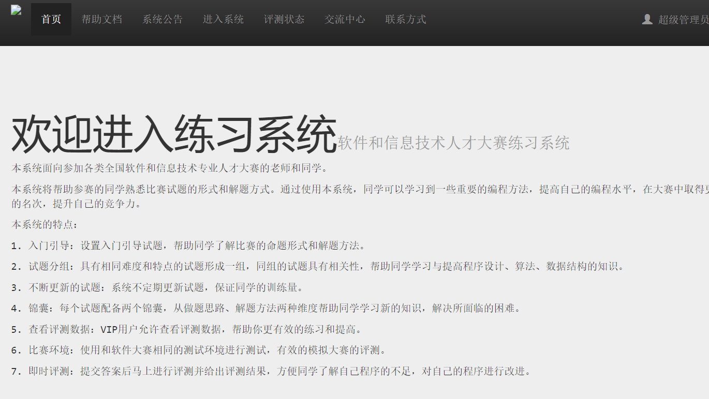

### 进入系统

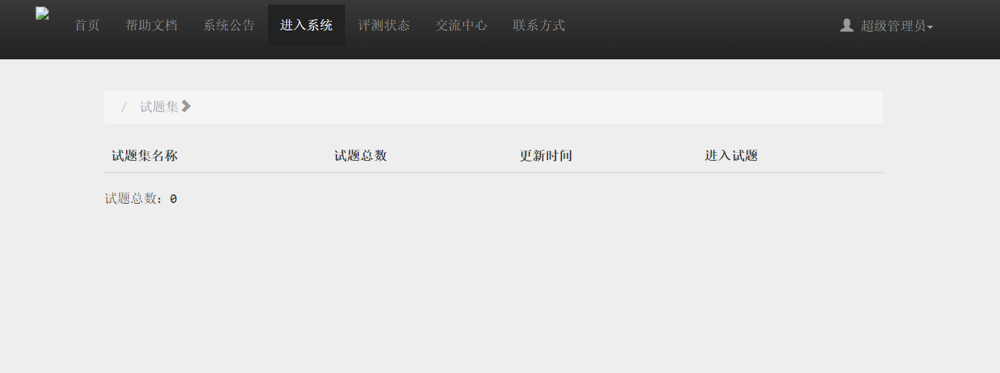

### 评测状态

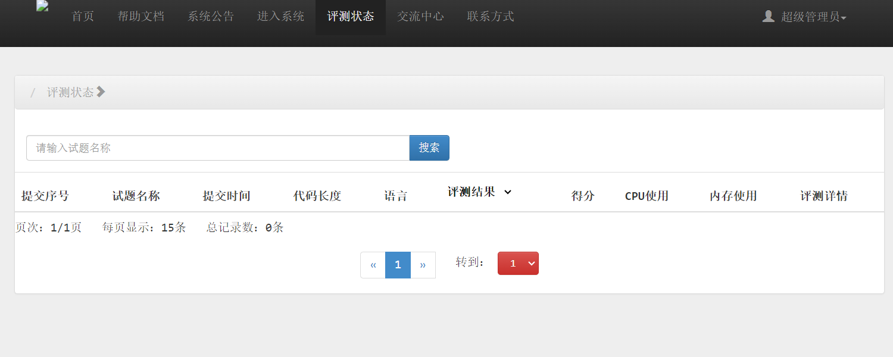

### 交流中心

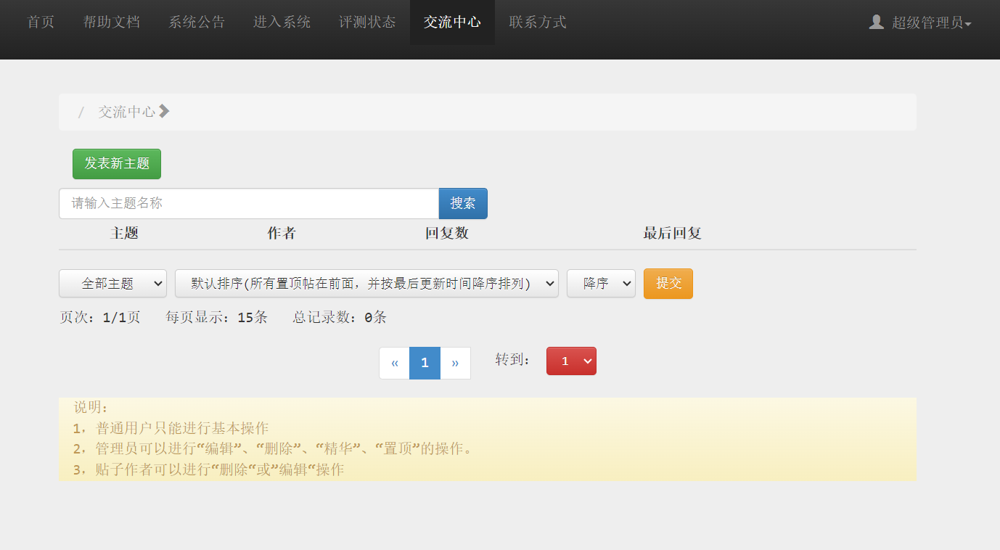

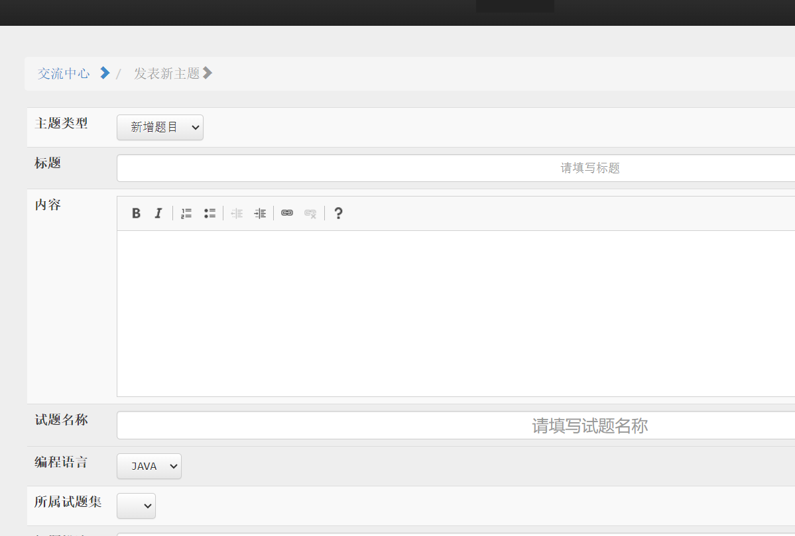

### 个人信息

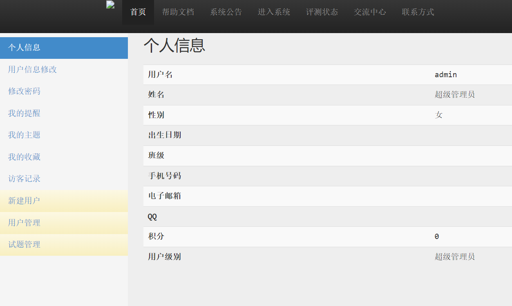


修改

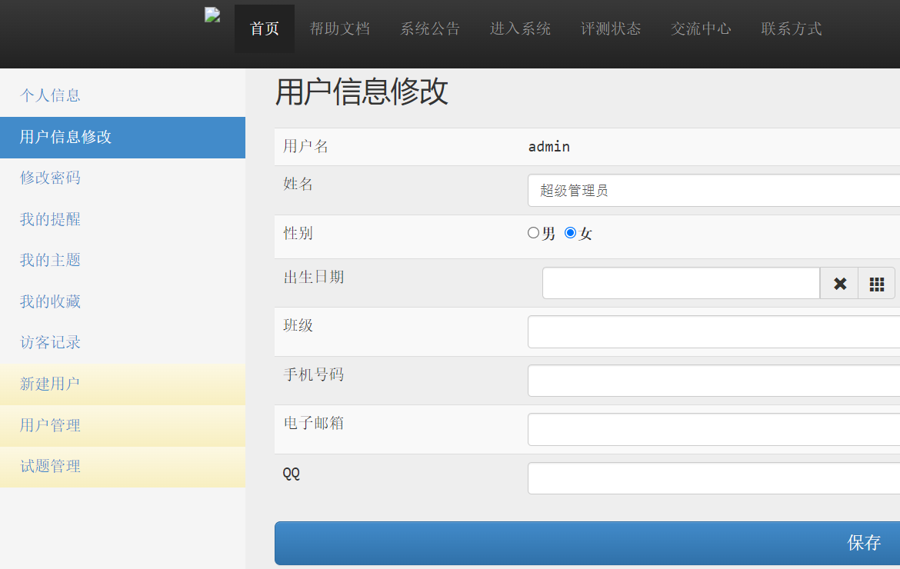


### 修改密码

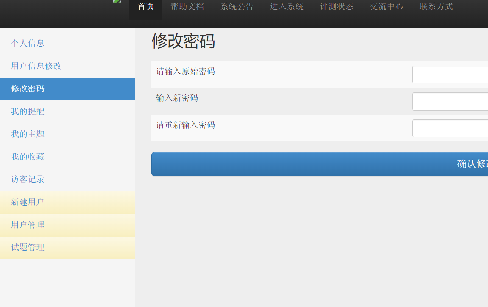

### 我的提醒

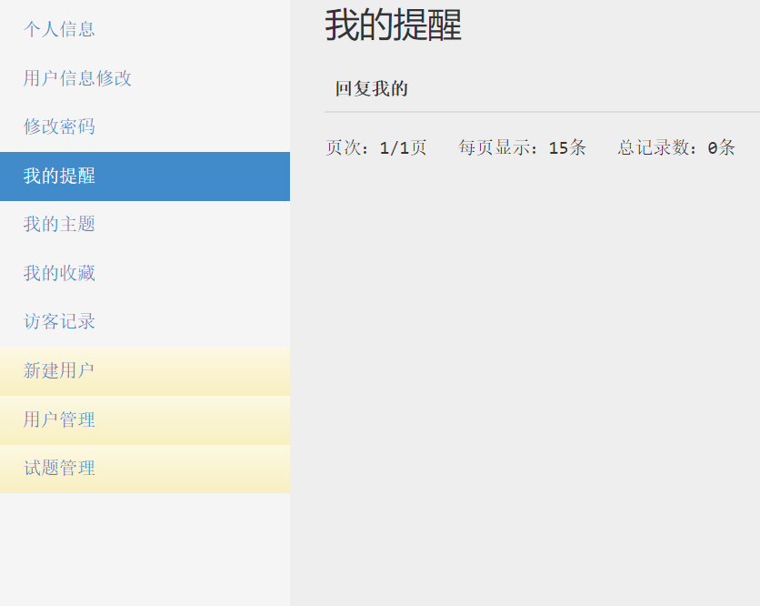

### 我的主题


### 我的收藏

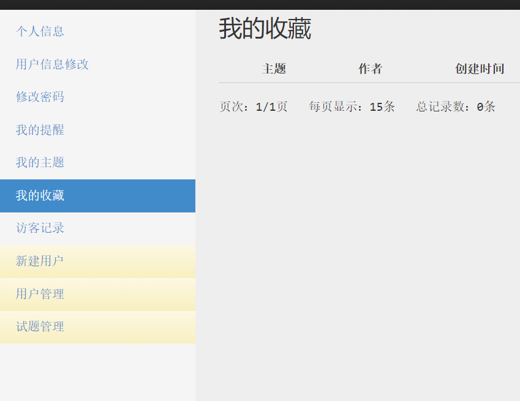

### 用户管理

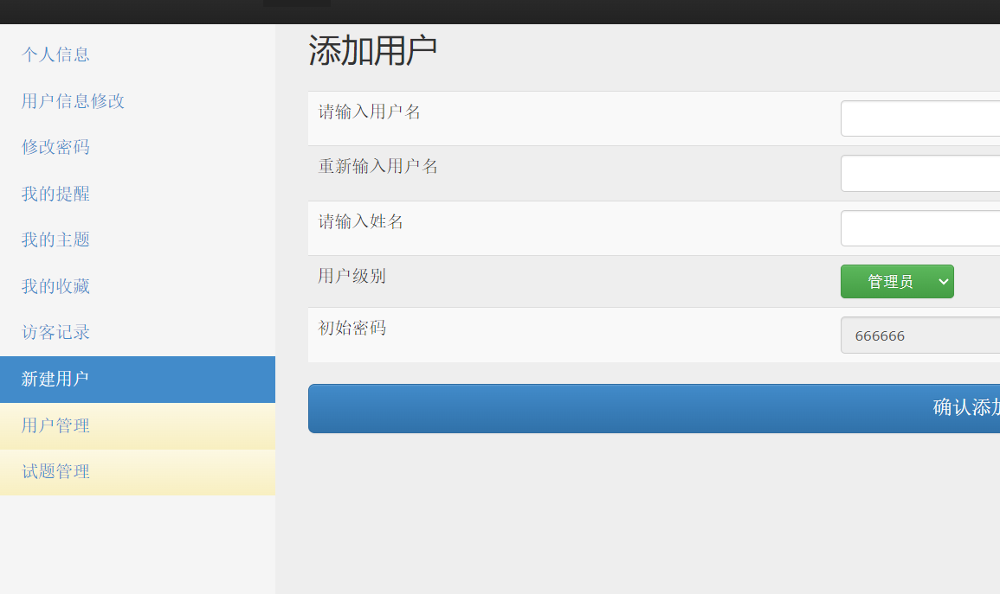

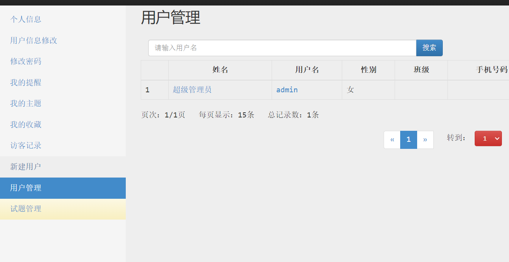

### 试题管理

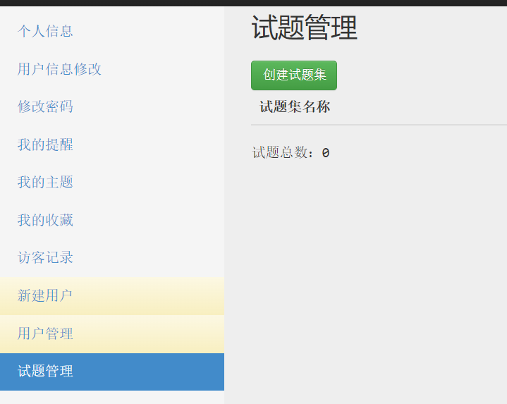

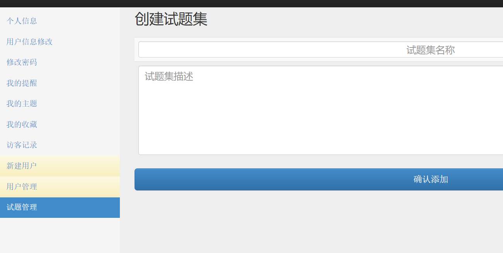

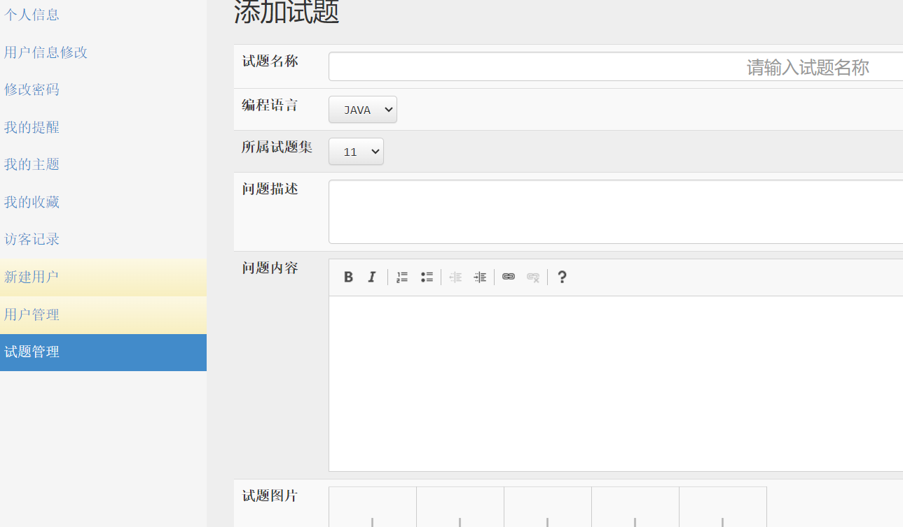
