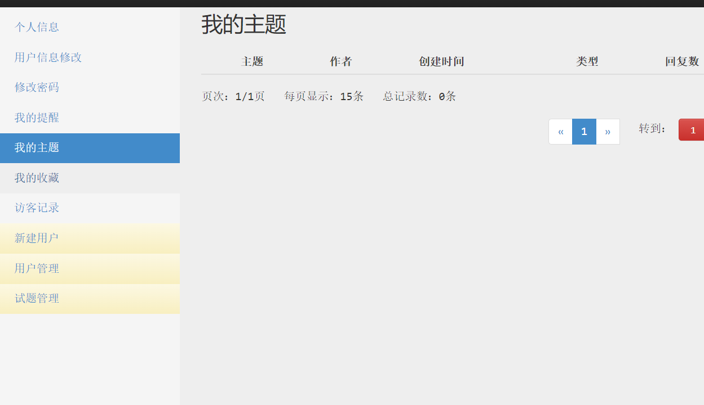

# 几年前在校期间写的一个编码竞赛程序

```
1、ssh2架构  
2、管理员发布编程竞赛题目和答案  
3、学生登录系统，在线提交代码  
4、后台对学生提交的代码实时编译并对运行结果进行评分  
5、输出学生竞赛结果
```

升级

struts2 2.3.37

spring 4.3.18.RELEASE

hibernate 4.3.7.Final

## 截图

### 首页


### 进入系统


### 评测状态


### 交流中心


### 个人信息


修改


### 修改密码


### 我的提醒


### 我的主题



### 我的收藏


### 用户管理


### 试题管理


